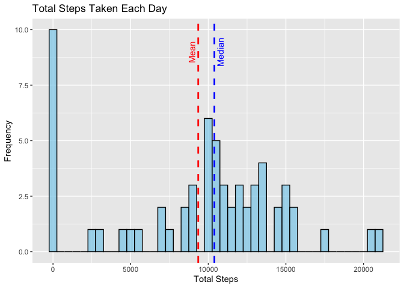
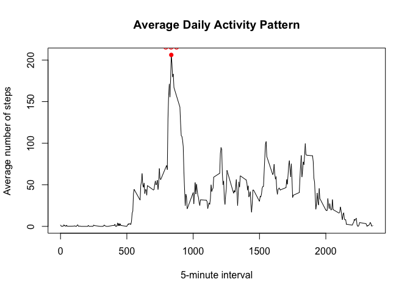
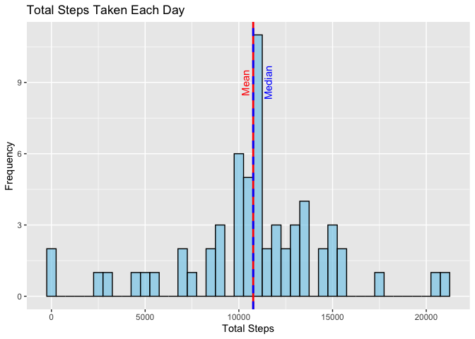
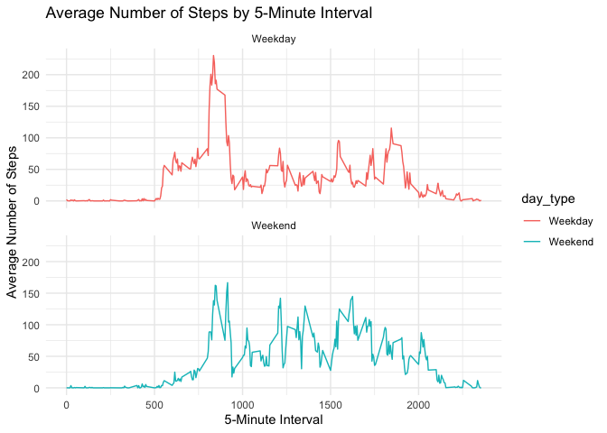

```r
knitr::opts_chunk$set(echo = TRUE, warning = FALSE, message = FALSE)
# Disable scientific notation output
options(scipen = 999)
```

## Introduction

#### This assignment makes use of data from a personal activity monitoring device. This device collects data at 5 minute intervals through out the day. The data consist of two months of data from an anonymous individual collected during the months of October and November, 2012 and include the number of steps taken in 5 minute intervals each day.

## Loading, exploring and preprocessing the data


```r
# Load required packages
library(tidyverse)
library(ggplot2)

# Provide session information about operating system, R version, and loaded packages
sessionInfo()
```

```
## R version 4.3.1 (2023-06-16)
## Platform: x86_64-apple-darwin20 (64-bit)
## Running under: macOS Big Sur 11.7.10
## 
## Matrix products: default
## BLAS:   /Library/Frameworks/R.framework/Versions/4.3-x86_64/Resources/lib/libRblas.0.dylib 
## LAPACK: /Library/Frameworks/R.framework/Versions/4.3-x86_64/Resources/lib/libRlapack.dylib;  LAPACK version 3.11.0
## 
## locale:
## [1] en_US.UTF-8/en_US.UTF-8/en_US.UTF-8/C/en_US.UTF-8/en_US.UTF-8
## 
## time zone: America/Chicago
## tzcode source: internal
## 
## attached base packages:
## [1] stats     graphics  grDevices utils     datasets  methods   base     
## 
## other attached packages:
##  [1] lubridate_1.9.2 forcats_1.0.0   stringr_1.5.0   dplyr_1.1.2    
##  [5] purrr_1.0.2     readr_2.1.4     tidyr_1.3.0     tibble_3.2.1   
##  [9] ggplot2_3.4.4   tidyverse_2.0.0
## 
## loaded via a namespace (and not attached):
##  [1] gtable_0.3.3      jsonlite_1.8.7    compiler_4.3.1    tidyselect_1.2.0 
##  [5] jquerylib_0.1.4   scales_1.2.1      yaml_2.3.7        fastmap_1.1.1    
##  [9] R6_2.5.1          generics_0.1.3    knitr_1.43        munsell_0.5.0    
## [13] bslib_0.5.1       pillar_1.9.0      tzdb_0.4.0        rlang_1.1.2      
## [17] utf8_1.2.4        stringi_1.7.12    cachem_1.0.8      xfun_0.40        
## [21] sass_0.4.7        timechange_0.2.0  cli_3.6.1         withr_2.5.2      
## [25] magrittr_2.0.3    digest_0.6.33     grid_4.3.1        rstudioapi_0.15.0
## [29] hms_1.1.3         lifecycle_1.0.4   vctrs_0.6.4       evaluate_0.21    
## [33] glue_1.6.2        fansi_1.0.5       colorspace_2.1-0  rmarkdown_2.24   
## [37] tools_4.3.1       pkgconfig_2.0.3   htmltools_0.5.6
```

```r
# Set the working directory
setwd("~/R for DS/RR_Wk2/")

# Read in data
df <- read.csv("activity.csv")

# Explore data summary
summary(df)
```

```
##      steps            date              interval     
##  Min.   :  0.00   Length:17568       Min.   :   0.0  
##  1st Qu.:  0.00   Class :character   1st Qu.: 588.8  
##  Median :  0.00   Mode  :character   Median :1177.5  
##  Mean   : 37.38                      Mean   :1177.5  
##  3rd Qu.: 12.00                      3rd Qu.:1766.2  
##  Max.   :806.00                      Max.   :2355.0  
##  NA's   :2304
```

```r
head(df, 10)
```

```
##    steps       date interval
## 1     NA 2012-10-01        0
## 2     NA 2012-10-01        5
## 3     NA 2012-10-01       10
## 4     NA 2012-10-01       15
## 5     NA 2012-10-01       20
## 6     NA 2012-10-01       25
## 7     NA 2012-10-01       30
## 8     NA 2012-10-01       35
## 9     NA 2012-10-01       40
## 10    NA 2012-10-01       45
```

```r
# Calculate the number of missing values (i.e. NAs)
sumNA <- sum(is.na(df$steps))

# Convert the date column from a character to date class
df$date <- as.Date(df$date)
```
#### There are 2304 rows with missing step values.

## What is mean total number of steps taken per day?


```r
# Calculate the average daily steps
dailySteps <- df %>% 
        group_by(date) %>% 
        summarize(totalSteps = sum(steps, na.rm = TRUE))
dailyMean <- mean(dailySteps$totalSteps)
dailyMedian <- median(dailySteps$totalSteps)

# Create a histogram of total steps taken each day
ggplot(dailySteps, aes(x = totalSteps)) +
  geom_histogram(binwidth = 500, fill = "skyblue", color = "black", alpha = 0.7) +
  labs(title = "Total Steps Taken Each Day",
       x = "Total Steps",
       y = "Frequency") +
  geom_vline(xintercept = mean(dailySteps$totalSteps, na.rm = TRUE), 
             color = "red", linetype = "dashed", size = 1, show.legend = FALSE) +
  geom_vline(xintercept = median(dailySteps$totalSteps, na.rm = TRUE), 
             color = "blue", linetype = "dashed", size = 1, show.legend = FALSE) +
  annotate("text", x = dailyMean - 600, y = 9, label = "Mean", color = "red", angle = 90,
           vjust = 1) +
  annotate("text", x = dailyMedian + 200, y = 9, label = "Median", color = "blue", angle = 90,
           vjust = 1) +
  theme_gray()
```

<!-- -->

#### Ignoring missing values, the mean number of steps per day is 9354.
#### The median number of steps per day is 10395.

## What is the average daily activity pattern?


```r
# Calculate the average number of steps for each 5-minute interval across all days
intervalMean <- tapply(df$steps, df$interval, mean, na.rm = TRUE)

# Create a time series plot
plot(names(intervalMean), intervalMean, type = "l",
     xlab = "5-minute interval", ylab = "Average number of steps",
     main = "Average Daily Activity Pattern")

# Identify the interval with the maximum average steps
max_interval <- names(intervalMean)[which.max(intervalMean)]

# Add a point or label to highlight the maximum interval
points(max_interval, intervalMean[max_interval], col = "red", pch = 16)
text(max_interval, intervalMean[max_interval], labels = max_interval, pos = 3, col = "red")
```

<!-- -->

#### The 835 time interval averages the most steps in a day.

## What is the impact of imputing missing values?

```r
naCount <- sum(is.na(df$steps))


# Create a new dataset with missing data filled in
filledDF <- df

# Fill in missing values in the step column with the mean steps
filledDF$steps[is.na(filledDF$steps)] <- intervalMean

# Calculate the average daily steps
dailySteps <- filledDF %>% 
        group_by(date) %>% 
        summarize(totalSteps = sum(steps, na.rm = TRUE))
dailyMean2 <- mean(dailySteps$totalSteps)
dailyMedian2 <- median(dailySteps$totalSteps)

# Create a histogram of total steps taken each day
ggplot(dailySteps, aes(x = totalSteps)) +
  geom_histogram(binwidth = 500, fill = "skyblue", color = "black", alpha = 0.7) +
  labs(title = "Total Steps Taken Each Day",
       x = "Total Steps",
       y = "Frequency") +
  geom_vline(xintercept = mean(dailySteps$totalSteps, na.rm = TRUE), 
             color = "red", linetype = "solid", size = 1, show.legend = FALSE) +
  geom_vline(xintercept = median(dailySteps$totalSteps, na.rm = TRUE), 
             color = "blue", linetype = "dashed", size = 1, show.legend = FALSE) +
  annotate("text", x = dailyMean2 - 600, y = 9, label = "Mean", color = "red", angle = 90,
           vjust = 1) +
  annotate("text", x = dailyMedian2 + 600, y = 9, label = "Median", color = "blue", angle = 90,
           vjust = 1) +
  theme_gray()
```

<!-- -->

```r
# Calculate the average number of steps for each 5-minute interval across all days
intervalMean <- tapply(filledDF$steps, filledDF$interval, mean)

# Create a time series plot
plot(names(intervalMean), intervalMean, type = "l",
     xlab = "5-minute interval", ylab = "Average number of steps",
     main = "Average Daily Activity Pattern")

# Identify the interval with the maximum average steps
max_interval <- names(intervalMean)[which.max(intervalMean)]

# Add a point or label to highlight the maximum interval
points(max_interval, intervalMean[max_interval], col = "red", pch = 16)
text(max_interval, intervalMean[max_interval], labels = max_interval, pos = 3, col = "red")
```

<!-- -->

#### Imputing missing values with the mean step value per interval increases the mean and cause the mean and median to converge because of the artificially inflated number of occurrences of the mean value. The initial daily mean of 9354 increases to 10766. The initial daily median of 10395 increases to 10766 with the imputing of mean interval steps. The 835 time interval still averages the most steps in a day.

## Are there differences in activity patterns between weekdays and weekends?

```r
# Create a new factor variable based on weekdays and weekends
filledDF$day_type <- factor(weekdays(filledDF$date) %in% c("Saturday", "Sunday"), 
                     levels = c(FALSE, TRUE), labels = c("Weekday", "Weekend"))

# Calculate average number of steps by 5-minute interval and day_type
avg_steps <- filledDF %>%
  group_by(interval, day_type) %>%
  summarize(mean_steps = mean(steps))
meanWeekday <- filledDF$steps[is.na(filledDF$steps)]

# Calculate average number of steps by date and day_type
typeSteps <- filledDF %>% 
        group_by(date, day_type) %>% 
        summarize(totalSteps = sum(steps, na.rm = TRUE))
meanWeekday <- mean(typeSteps$totalSteps[typeSteps$day_type == 'Weekday'])
meanWeekend <- mean(typeSteps$totalSteps[typeSteps$day_type == 'Weekend'])
medianWeekday <- median(typeSteps$totalSteps[typeSteps$day_type == 'Weekday'])
medianWeekend <- median(typeSteps$totalSteps[typeSteps$day_type == 'Weekend'])

# Create a 2-panel time series plot
ggplot(avg_steps, aes(x = interval, y = mean_steps, group = day_type, color = day_type)) +
  geom_line() +
  facet_wrap(~day_type, scales = "fixed", ncol = 1) +
  labs(title = "Average Number of Steps by 5-Minute Interval",
       x = "5-Minute Interval",
       y = "Average Number of Steps") +
  theme_minimal()
```

<!-- -->

#### Analyzing the step data by weekdays and weekends reveals that the mean weekday steps are 10256 and the mean weekend steps are 12202. The median weekday steps are 10765 and the median weekend steps are 11646. It also reveals that there is a more constant activity level throughout weekend days in contrast to an elvated activity level on weekday mornings that peters out throughout the day.
